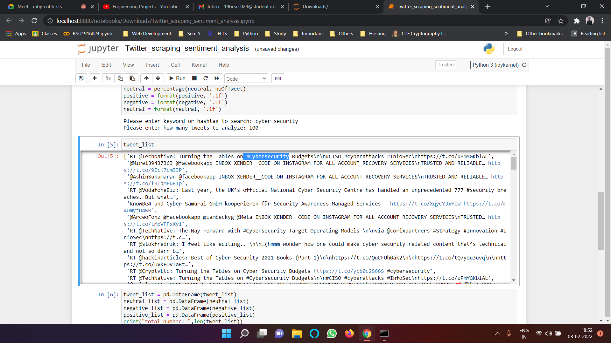
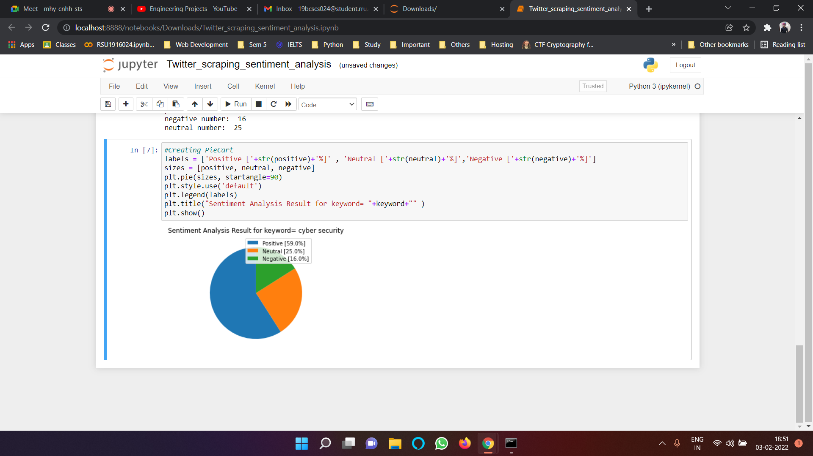

# Twitter_Scraping
Twitter tweets extracting using python

Our project is to extract data from twitter for a particular hashtag then we will analyze the sentiment of the public on twitter.
Web scraping is the process of using bots to extract content and data from a website. Unlike a screen scraping, which only copies pixels displayed on screen, web scraping extracts underlying HTML code and, with it, data stored in a database. The scraper can then replicate entire website content elsewhere. For example: We want to get data of Samsung, realm, redeemed, one+ phones. From a web scraping of flipkart or amazon like websites and get previously mentioned data of phones.

If you want show live demonstration, go throgh this link: https://youtu.be/99t-sqI4V_4

